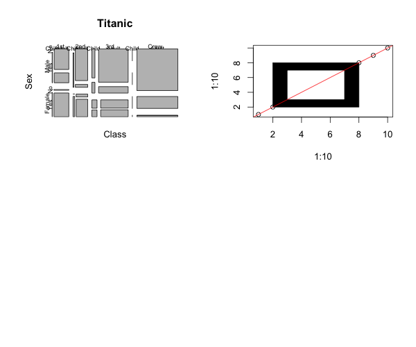
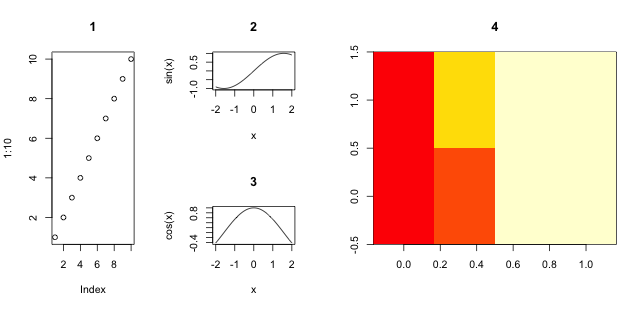
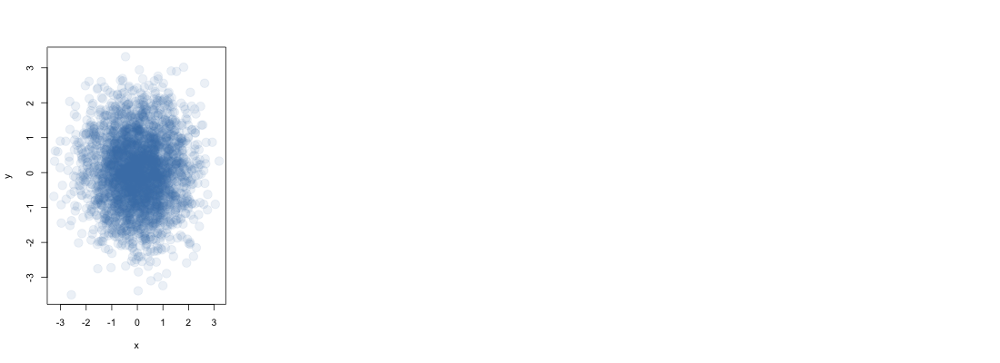
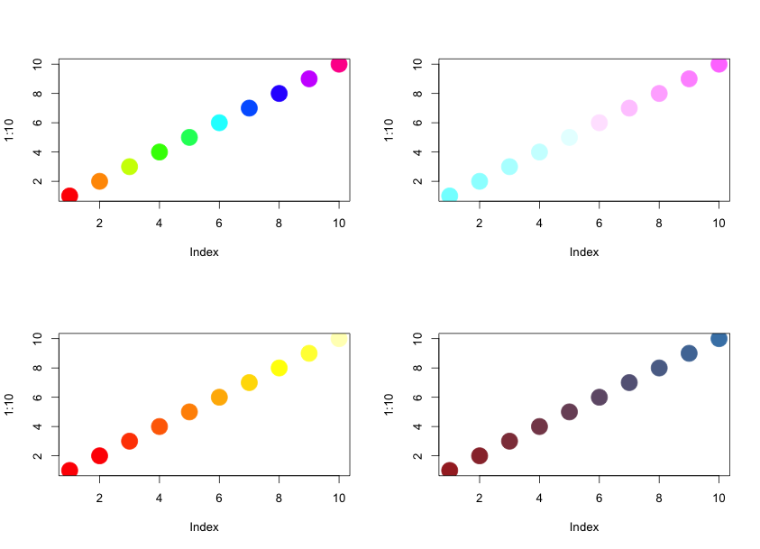
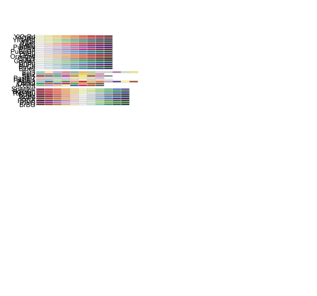
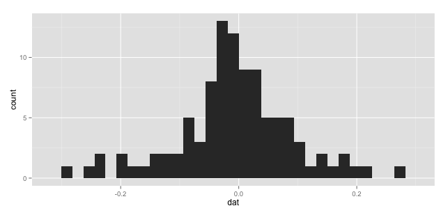
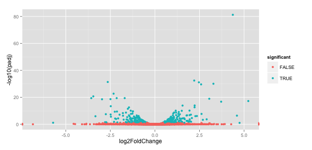
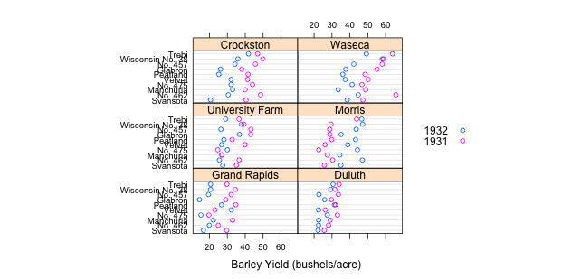

## Base graphics

### Painters model

Graphical elements are added to the canvas one layer at a time, and
the picture builds up in levels. Lower levels are obscured by higher
levels, allowing for blending, masking and overlaying of objects.


```{r}
plot(Titanic)
plot(1:10, 1:10)
rect(2, 2, 8, 8, col = "black")
rect(3, 3, 7, 7, col = "white")
abline(0, 1, col = "red")
```



### High level plotting functions

High level plotting functions produce an appropriate chart based on
the input.

- `plot`: generic plotting function. By default produces scatter plots
  but other `type`s can be set.

```{r}
par(mfrow = c(2, 2))
plot(1:10, type = "p", main = "points (default)")
plot(1:10, type = "l", main = "lines")
plot(1:10, 10:1, type = "b", main = "both (points and lines)")
plot(1:10, type = "h", main = "histogram")
```
![plot of chunk Rviz.md-2] (figures/Rplot08.png)


- `barplot`


```{r}
par(mfrow = c(1, 2))
barplot(c(1, 2, 3, 4))
s <- sample(letters, 1000, replace = TRUE)
barplot(table(s))
```
![plot of chunk Rviz.md-3] (figures/Rplot09.png)

- `boxplot`


```{r}
par(mfrow = c(1, 2))
l <- lapply(1:10, rnorm)
boxplot(l)
m <- matrix(rnorm(1000), ncol = 10)
boxplot(m, names = LETTERS[1:10])
```
![plot of chunk Rviz.md-4] (figures/Rplot10.png)

- histograms: `hist`


```{r}
par(mfrow = c(1, 2))
x <- rnorm(10000)
hist(x)
hist(x, breaks = 50, freq = FALSE)
lines(density(x), col = "red")
```
![plot of chunk Rviz.md-5] (figures/Rplot11.png)

- `pie` (not recommended)


```{r}
pie(c(1, 2, 3, 4))
```
![plot of chunk Rviz.md-6] (figures/Rplot12.png)

- `curve`


```{r}
curve(x^2, 0, 10)
```
![plot of chunk Rviz.md-7] (figures/Rplot13.png)

- `matplot`

```{r}
m <- matrix(rnorm(30), ncol = 3)
dimnames(m) <- list(genes = paste("Gene", 1:10), sample = LETTERS[1:3])
matplot(t(m), type = "b")
```
![plot of chunk Rviz.md-8] (figures/Rplot14.png)

- `image` and `heatmap`

```{r}
heatmap(m, col = cm.colors(256))
```
![plot of chunk Rviz.md-9] (figures/Rplot15.png)

### Low level interaction

Low level interaction with the drawing device to build up a figure
piece by piece.

- `points`, `lines`, `rect`, `arrows`, `axis`, `abline`, ...


```{r}
plot(1:10)
points(1:3, 3:1, pch = 19, col = "red")
lines(c(10, 1), c(1, 10))
lines(c(9, 1), c(1, 9), lty = "dotted", lwd = 3)
rect(8, 8, 10, 10, col = "black")
arrows(5, 1, 5, 10)
abline(v = 2, col = "blue")
abline(h = 2, col = "steelblue")
grid()
```
![plot of chunk Rviz.md-10] (figures/Rplot16.png)

### Numerous parameters to be tuned

- See `par`:
  - margins (`mar`, ...), grid of figures (`mfrow` and `mfcol`), ...
  - `las`: axes label style
- Arbitrary graph `layout`


```{r}
(m <- matrix(c(1, 1, 2, 3, 4, 4, 4, 4), nrow = 2))
```

```
 [,1] [,2] [,3] [,4]
[1,]    1    2    4    4
[2,]    1    3    4    4
```

```{r}
layout(m)
plot(1:10, main = 1)
curve(sin(x), from = -2, to = 2, main = 2)
curve(cos(x), from = -2, to = 2, main = 3)
image(t(m), main = 4)
```


- Point symbols (plotting character): `pch`
- Symbol sizes (character expansion): `cex`
- ...

### Adding text on graphs
- `title`: for main and sub-titles
- `mtext`: margin text
- `text`: text at `x` and `y` positions
- `legend`

### Devices


By default, the figures are produced on the screen device
(`dev.new()`). Other devices can be opened prior to plotting: `pdf`,
`postscript`, `png`, `jpeg`, `svg`, ... each with their respective
options including a file name. After plotting, the device must be
closed with `dev.off()`.


```{r}
pdf("fig.pdf")
plot(1:10)
dev.off()
```
It is possible to open multiple devices and navigate them with
`dev.prev()`, `dev.next()` and set the active device (the one in which
the graphics operation occur) with `dev.set(n)`. If a screen device is
open, its content can be copied into another file device with
`dev.copy()`, `dev.copy2pdf()`, ...

### Colours

- Colours can be set by their names (see `colors()`) or by the RGB
  (red, green, blue) specification (as hexadecimals). The `scales`
  package `col2hcl` allows to translate any colour to its RGB
  hexadecimal values. In addition, a fourth (0 <= `alpha`<= 1 in
  `col2hcl`) channel defines transparency (`FF` is opaque, `00` is
  completely transparent).


```{r}
library("scales")
```

```
### Loading required package: methods
```

```{r}
cl <- col2hcl("steelblue", alpha = 0.1)
x <- rnorm(3000)
y <- rnorm(3000)
plot(x, y, pch = 19, col = cl, cex = 2)
```



The `smoothScatter` function can be used to use colour density to
  represent point density


```{r}
smoothScatter(x, y)
```

```
## KernSmooth 2.23 loaded
## Copyright M. P. Wand 1997-2009
```
![plot of chunk Rviz.md-14] (figures/Rplot19.png)

- Colour palettes: `rainbow(n)`, `heat.colors(n)`,
`terrain.colours(n)`, `topo.colors(n)`, `cm.colors(n)` or using
`colorRampPalette`:


```{r}
brblramp <- colorRampPalette(c("brown", "steelblue"))
par(mfrow = c(2, 2))
plot(1:10, pch = 19, col = rainbow(10), cex = 3)
plot(1:10, pch = 19, col = cm.colors(10), cex = 3)
plot(1:10, pch = 19, col = heat.colors(10), cex = 3)
plot(1:10, pch = 19, col = brblramp(10), cex = 3)
```




- The `RColorBrewer` package provides a series of well defined colour
  palettes for maximal discrimination, paired data, ...


```{r}
library("RColorBrewer")
display.brewer.all()
```



### Other
- `locator` to obtain the `x` and `y` from a mouse click.
- `identify` to identify index of label of the closest point to a mouse click.

## `ggplot2`

Based on the **Grammar of Graphics**
- A plot is made up of multiple layers
- A layer consists of *data* (must be a `data.frame`), a set of
  *mappings* between variables and *aesthetics* (`aes`), a *geometric
  object* (`geom`) and a *statistical transformation*
- Scales control the details of the mapping
- All components are independent and reusable

### Visualizing phylogenies

#### Tree simulation

```{r}
library("ape")
require(ape)
tree<-rcoal(10)  # Make a random tree 
trait<-rTraitCont(tree,model="BM") # Simulate a trait on that tree
```

##### Write a function to make a tree, simulate a BM trait, and take the mean of that trait.

```{r}
myfunc<-function(n){
  tree<-rcoal(n); trait<-rTraitCont(tree,model="BM"); mean(trait)}

# Do it 100 times and make a data.frame required for ggplot2 plotting 

dat<-replicate(100,myfunc(10))
dat2<-data.frame(dat)

# Plot results

require(ggplot2)
ggplot(dat2,aes(dat)) + geom_histogram()  # Add layer of histogram

```

```
[1] 0.02962051
stat_bin: binwidth defaulted to range/30. Use 'binwidth = x' to adjust this.

```



### Differential Gene expression analysis using R and Bioconductor - Visualizing Pasilla BAM Subset Data

In this section we'll analyze some publicly available gene expression data using R and bioinformatics-focussed R packages 
in [Bioconductor] (http://bioconductor.org/).

#### Packages

Most generic R packages are hosted on the Comprehensive R Archive Network ([CRAN](http://cran.us.r-project.org/)). To install 
one of these packages, you would use `install.packages("packagename")`. You only need to install a package once, then load it each time using 
`library(packagename)`. Let's install **ggplot2** package and load it.

```{r}
# Install only once.
install.packages("ggplot2")

# Load the package every time you want to use it.
library(ggplot2)
```
#### Bioconductor

Bioconductor packages work a bit different, and are not hosted on CRAN. Go to [](http://bioconductor.org/) to learn more about the Bioconductor project.
To use any Bioconductor package, you'll need a few "core" Bioconductor packages. Run the following commands to (1) download the installer script, and (2) install some core Bioconductor packages. You'll need internet connectivity to do this, and it'll take a few minutes, but it only needs to be done once. 

```{r}
# Download the installer script

source("http://bioconductor.org/biocLite.R")

# biocLite() is the bioconductor installer function. Run it without any
# arguments to install the core packages or update any installed packages.
# This requires internet connectivity and will take some time!

biocLite()

```
To install specific packages, first download the installer script if you haven't done so, and use `biocLite("packagename")`.This only needs to be done once then you can load the package like any other package. Let's download the [DESeq2 package] (http://www.bioconductor.org/packages/release/bioc/html/DESeq2.html):

```{r}
# Do only once
source("http://bioconductor.org/biocLite.R")
biocLite("DESeq2")

# Every time you need to use the DESeq2 package
library(DESeq2)
```

Bioconductor packages usually have great documentation in the form of vignettes. For a great example, take a look at the [DESeq2 vignette for analyzing count data](http://www.bioconductor.org/packages/release/bioc/vignettes/DESeq2/inst/doc/DESeq2.pdf).

#### Analyzing publicly available RNA-seq data

We're going to do partial RNA-seq analysis. This analysis is right before the statistical side - Data processing is done which is  necessary to get a vector count data for one sample. 
Simply iterating the process for each sample will leave us with the data necessary to do a differential expresssion analysis in R using such packages as `edgeR` and `DESeq`.

This example ties in most packages `GenomicRanges`, `Rsamtools` and `GenomicFeatures` to do an example biological analysis.

The data we're going to use is from `pasillaBamSubset` package and contains a subset of `pasilla` data, which is packaged with `DESeq` and `DEXseq`.

We need to step through each one as below (Any of the missing packages can be downloaded using `biocLite("packagename")`:

##### Load packages:

```{r}
library(pasillaBamSubset)
library(DESeq)

library(pasilla)

library(TxDb.Dmelanogaster.UCSC.dm3.ensGene)
library(GenomicRanges)
library(Rsamtools)
```

##### Now we need to read in a BAM file, which in most cases represents the aligned reads for one sample (that is one replicate from one treatment group). It's possible that a sample has more than one BAM file (i.e. one for paired-end reads and one for single-end reads), but let's keep it simple.

Bioconductor has nicely wrapped some of the BAM files that underlie the pasilla dataset into an R package. We can get access to these BAM files by calling a function that simply returns the location.

```{r}
bf <- untreated1_chr4()
```

##### Load full data

```{r}
data(pasillaGenes)
```

##### PasillaGenes DESeq

If we iterate through each sample, we would end up with a raw counts table. We could now run through a differential expression analysis of data using `edgeR` or `DESeq`.

We'll quickly run through an example here, but **note:** read the `DESeq` vignette and study the paper before applying this to your own data. 
   
```{r}
library(DESeq)

# emulate a starting point
d <- counts(pasillaGenes)

treatments <- c("treated", "treated", "treated", "untreated", "untreated", 
    "untreated", "untreated")

head(d)

```

```
##             treated1fb treated2fb treated3fb untreated1fb untreated2fb
## FBgn0000003          0          1          1            0            0
## FBgn0000008        118        139         77           89          142
## FBgn0000014          0         10          0            1            1
## FBgn0000015          0          0          0            0            0
## FBgn0000017       4852       4853       3710         4640         7754
## FBgn0000018        572        497        322          552          663
##             untreated3fb untreated4fb
## FBgn0000003            0            0
## FBgn0000008           84           76
## FBgn0000014            0            0
## FBgn0000015            1            2
## FBgn0000017         4026         3425
## FBgn0000018          272          321
```

```{r}
treatments
```
```
## [1] "treated"   "treated"   "treated"   "untreated" "untreated" "untreated"
## [7] "untreated"
```

```{r}
pcd <- newCountDataSet(d, treatments)

pcd <- estimateSizeFactors(pcd)

pcd <- estimateDispersions(pcd)
```

We can use `nbinomTest` to build a top table now.

```{r}
res <- nbinomTest(pcd, "treated", "untreated")
head(res)
```

```
##            id  baseMean baseMeanA baseMeanB foldChange log2FoldChange
## 1 FBgn0000003    0.2846    0.6641    0.0000     0.0000           -Inf
## 2 FBgn0000008  100.6816  102.6988   99.1687     0.9656       -0.05046
## 3 FBgn0000014    1.5043    2.9641    0.4095     0.1382       -2.85552
## 4 FBgn0000015    0.5630    0.0000    0.9852        Inf            Inf
## 5 FBgn0000017 4606.2186 4167.1441 4935.5244     1.1844        0.24414
## 6 FBgn0000018  435.6703  426.5805  442.4876     1.0373        0.05282
##     pval   padj
## 1 0.6120 1.0000
## 2 0.7080 1.0000
## 3 0.4037 1.0000
## 4 0.5659 1.0000
## 5 0.1296 0.8417
## 6 0.7462 1.0000
```
And, we could now create an volcano. We'll do this in `ggplot2` to see it's power.

```{r}
res$significant <- res$padj < 0.1
ggplot(res) + geom_point(aes(x = log2FoldChange, y = -log10(padj), 
    color = significant))
```
```
Warning message:
Removed 2634 rows containing missing values (geom_point). 
```



## `lattice`

The `lattice` package provides its own set of high-level plotting functions for `data.frames`, with an emphasis on multi-variate data visualization.
It makes heavily use of the `formula` interface to produce effective data visualizations. 

The `lattice` package is distributed with **R** but not loaded by default. It
provides a very expressive way to visualize data. The following example plots
yield for a number of barley varieties, conditioned on site and grouped by year.Note the common scales, efficient
use of space, and not-too-pleasing default color palette. The Waseca sample
appears to be mis-labelled for `year`, an apparent error in the original data.

We can find out about the built-in data set used in this example with `?barley`.

```{r}
library(lattice)
dotplot(variety ~ yield | site, data = barley, groups = year,key = simpleKey(levels(barley$year), space = "right"), xlab = "Barley Yield (bushels/acre) ",aspect=0.5, layout = c(2,3), ylab=NULL)

```



## Interactive visualisation

- [`shiny`](http://www.rstudio.com/shiny/)
- [`googleVis`](http://code.google.com/p/google-motion-charts-with-r/)
- [`rCharts`](http://rcharts.io/)

## Resources

- `ggplot2` [web page](http://ggplot2.org/) and [book](http://www.amazon.com/dp/0387981403) (slightly outdated though).
- [R Graphics Cookbook](http://www.amazon.com/dp/1449316956).
- [R Graphics](https://www.stat.auckland.ac.nz/~paul/RG2e/) book.
- [Lattice: Multivariate Data Visualization with R](http://lmdvr.r-forge.r-project.org/figures/figures.html) book.
- [R Graphical Manual](http://rgm3.lab.nig.ac.jp/RGM/)

